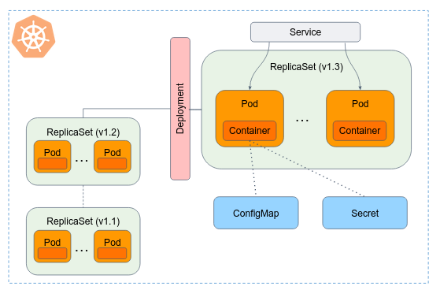
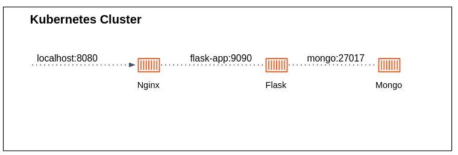

# Kubernetes core components

## Workloads

A **Workload** is an application running on Kubernetes.
Whether your workload is a single Docker container, or several containers that work together (e.g. HA mongo cluster), on Kubernetes you run it inside a set of **Pods**.

In this tutorial we will cover the following workloads:

- Pod
- ReplicaSet
- Deployment

### Pods

Official docs [reference](https://kubernetes.io/docs/concepts/workloads/pods/). 

Pods are the smallest deployable units of computing that you can create and manage in Kubernetes.
A Pod is a group of one or more containers (usually one), with **shared storage** and **network resources**, and a specification for how to run the containers.

The following is an example of a Pod which consists of a container running the image `emailservice:v0.7.0`. This is the image upon which the `emailservice` service, from the Online Boutique app, is based on.

```yaml
# k8s/pod-demo.yaml

apiVersion: v1
kind: Pod
metadata:
  name: emailservice-pod-test
  labels:
    project: online-boutique
    env: prod
    release: v0.7.0-stable
spec:
  containers:
  - name: server
    image: gcr.io/google-samples/microservices-demo/emailservice:v0.7.0
```

To create the Pod shown above, run the following command (the above content can be found in `k8s/simple-pod.yaml`):

```bash
kubectl apply -f k8s/simple-pod.yaml
```

When a Pod gets created, the new Pod is scheduled to run on a Node in your cluster.
The Pod remains on that node until the Pod finishes execution, the Pod object is deleted, the Pod is evicted for lack of resources, or the node fails.

The `labels` attached to the pod can be used to list or describe it.

Labels are key/value pairs that are attached to objects such as Pods.
Labels are intended to be used to specify identifying attributes of objects that are meaningful and relevant to users, as well as organizing a subsets of objects.
[Read here](https://kubernetes.io/docs/concepts/overview/working-with-objects/common-labels/) about labeling best practice.

```console
$ kubectl get pods -l release=v0.7.0-stable
NAME                    READY   STATUS    RESTARTS   AGE
emailservice-pod-test   1/1     Running   0          14s
$ kubectl describe pods -l release=v0.7.0-stable
Name:             emailservice-pod-test
Namespace:        default
Priority:         0
Service Account:  default
Node:             minikube/192.168.49.2
Start Time:       Sun, 24 Sep 2023 16:34:48 +0000
Labels:           app=online-boutique
                  env=prod
                  release=v0.7.0-stable
Annotations:      <none>
Status:           Running
IP:               10.244.0.87
IPs:
  IP:  10.244.0.87
Containers:
  server:
    Container ID:   docker://b93064757aa593c7be63edbb4796cdb468ccf1f5d527f0872e7adc7692127f7c
    Image:          gcr.io/google-samples/microservices-demo/emailservice:v0.7.0
    Image ID:       docker-pullable://gcr.io/google-samples/microservices-demo/emailservice@sha256:53d0416f79e3d4ba8d2092d7c48880375e3398f6e086996aa12b2e68d0a04976
    Port:           <none>
    Host Port:      <none>
    State:          Running
      Started:      Sun, 24 Sep 2023 16:34:49 +0000
    Ready:          True
    Restart Count:  0
    Environment:    <none>
    Mounts:
      /var/run/secrets/kubernetes.io/serviceaccount from kube-api-access-lw7mq (ro)
Conditions:
  Type              Status
  Initialized       True 
  Ready             True 
  ContainersReady   True 
  PodScheduled      True 
Volumes:
  kube-api-access-lw7mq:
    Type:                    Projected (a volume that contains injected data from multiple sources)
    TokenExpirationSeconds:  3607
    ConfigMapName:           kube-root-ca.crt
    ConfigMapOptional:       <nil>
    DownwardAPI:             true
QoS Class:                   BestEffort
Node-Selectors:              <none>
Tolerations:                 node.kubernetes.io/not-ready:NoExecute op=Exists for 300s
                             node.kubernetes.io/unreachable:NoExecute op=Exists for 300s
Events:
  Type    Reason     Age   From               Message
  ----    ------     ----  ----               -------
  Normal  Scheduled  21m   default-scheduler  Successfully assigned default/emailservice-pod-test to minikube
  Normal  Pulled     21m   kubelet            Container image "gcr.io/google-samples/microservices-demo/emailservice:v0.7.0" already present on machine
  Normal  Created    21m   kubelet            Created container server
  Normal  Started    21m   kubelet            Started container server
```

In the above output we can see a detailed description of the pod. Reviewing all the presented information can be overwhelmed, but here are a few important notes:

- In you don't specify in which **namespace** to create the Pod object, the `default` namespace is used.
- Each Pod is assigned a unique IP address.
- Pod **events** can help you debug your pod state. 

### Workload resources 

Usually you don't need to create Pods directly. 
Each Pod is meant to run a single instance of a given application. 
If you want to scale your application horizontally, you should replicate the Pod in different nodes. Replicated Pods are usually created and managed as a group by a **Workload Resource**.

Workload resources create and manage multiple Pods for you, with many added benefits.
They handle replication and rollout and automatic healing in case of Pod failure.
For example, if a Node fails, a workload resource notices that Pods on that Node have stopped working and creates a replacement Pod. 

Available workload resources are:

- **Deployment** (and, indirectly, **ReplicaSet**), the most common way to run an stateless applications on your cluster.
- A **StatefulSet** lets you run Pods connected to a persistent storage.
- A **DaemonSet** lets you run single Pod on each Node of your cluster.
- You can use a **Job** (or a **CronJob**) to define tasks that (periodically) run to completion and then stop.

**Note:** Workload resources don't run containers directly, the only object in Kubernetes that does so is the Pod.
All other workload resources **only manage Pods**. For that reason, workload resources are also known as **Controllers**.
In Kubernetes, controllers are control loops that watch the state of your Pods, then make or request changes where needed. Each controller tries to move the current state closer to the desired state.

In this tutorial we will focus on **Deployment** and **ReplicaSet**. 

### ReplicaSet

A **ReplicaSet**'s purpose is to maintain a stable set of replica Pods running at any given time.
As such, it is often used to guarantee the availability of a specified number of identical Pods.

Here is an example of ReplicaSet:

```yaml 
# k8s/replicaset-demo.yaml 

apiVersion: apps/v1
kind: ReplicaSet
metadata:
  name: emailservice-replicaset-demo
  labels:
    app: emailservice-demo
spec:
  replicas: 3
  selector:
    matchLabels:
      app: emailservice-demo
  template:
    metadata:
        labels:
          app: emailservice-demo
    spec:
      containers:
      - name: server
        image: gcr.io/google-samples/microservices-demo/emailservice:v0.7.0
```

In this example:

- The `.spec.template` field contains a [PodTemplates](https://kubernetes.io/docs/concepts/workloads/pods/#pod-templates). PodTemplates are specifications for creating Pods. As you can see it's very similar to `Pod` YAML described in the previous section.
  We can also notice that pods created from this template hold a label with key `app` and value `emailservice`.
- The ReplicaSet creates three replicated Pods, indicated by the `.spec.replicas` field.
- The `.spec.selector.matchLabels` field defines how the created ReplicaSet finds which Pods to manage (remember that ReplicaSet is a controller that manage Pods). In this case, the ReplicaSet will manage all Pods that match the label `app: emailservice-demo`, corresponding to the label we gave in the Pod template. 

Let's apply this ReplicaSet in the cluster.

```bash 
kubectl apply -f k8s/replicaset-demo.yaml
```

You can then get the current ReplicaSets deployed:

```bash 
kubectl get rs
```

You can also check for the Pods brought up as part of the ReplicaSet:

```bash 
kubectl get pods -l app=emailservice-demo
```

Let's play with your ReplicaSet:

- Delete one of the pods owned by the ReplicaSet. What happened? 
- A ReplicaSet can be easily scaled up or down by simply updating the `.spec.replicas` field. Try it out...
- Create a Pod (separately to the ReplicaSet) in the cluster, with the same label key and value as you gave in the PodTemplate. What happened? Why? 
- Try to update the image version in the YAML manifest to `emailservice:v0.8.0`, and perform `kubectl apply` with the updated YAML file. What happened? Why? 

Delete your ReplicaSet before moving on to the next section:

```bash
kubectl delete replicaset emailservice-replicaset-demo
```

### Deployment

We started our tutorial with a bare Pod, then moved to work with a ReplicaSet.
However, this is not good enough. For example, as you've probability noticed, Replicaset does not automatically update containers when image version is updates. 

A **Deployment** is a higher-level concept that manages ReplicaSets and provides declarative updates to Pods along with a lot of other useful features.
In most cases, **ReplicaSet is not being used directly**. Kubernetes' docs recommending using Deployments instead of directly using ReplicaSets.

The following is an example of a Deployment:

```yaml
# k8s/deployment-demo.yaml

apiVersion: apps/v1
kind: Deployment
metadata:
  name: emailservice-deployment-demo
  labels:
    app: emailservice-demo
spec:
  replicas: 3
  selector:
    matchLabels:
      app: emailservice-demo
  template:
    metadata:
        labels:
          app: emailservice-demo
    spec:
      containers:
      - name: server
        image: gcr.io/google-samples/microservices-demo/emailservice:v0.7.0
```

To see the Deployment rollout status, run `kubectl rollout status deployment/emailservice-deployment-demo`

Under the hood, the Deployment object created a ReplicaSet (`rs`) for you:

```console
$ kubectl get rs
NAME                                      DESIRED   CURRENT   READY   AGE
emailservice-deployment-demo-75675f5897   3         3         3       18s
```

#### Updating a Deployment 

A Deployment's rollout is triggered if and only if the Deployment's Pod template (that is, `.spec.template`) is changed.

Let's update the `emailservice-deployment-demo` Pods to use the `emailservice:v0.8.0` image instead of the `emailservice:v0.7.0` image.
In the Deployment YAML manifest, edit the `.spec.template.spec.containers[0].image` value, and apply again.

Run `kubectl get rs` to see that the Deployment updated the Pods by **creating a new ReplicaSet** and scaling it up to 3 replicas, as well as scaling down **the old ReplicaSet** to 0 replicas.
This actually means that the Deployment manipulate ReplicaSet objects for you.

This process is known as `RollingUpdate`. 

```console
$ kubectl describe deployments emailservice-deployment-demo
Name:                   emailservice-deployment-demo
Namespace:              default
CreationTimestamp:      Thu, 28 Sep 2023 20:10:41 +0000
Labels:                 app=emailservice-demo
Annotations:            deployment.kubernetes.io/revision: 2
Selector:               app=emailservice-demo
Replicas:               3 desired | 3 updated | 3 total | 3 available | 0 unavailable
StrategyType:           RollingUpdate
MinReadySeconds:        0
RollingUpdateStrategy:  25% max unavailable, 25% max surge
Pod Template:
  Labels:  app=emailservice-demo
  Containers:
   server:
    Image:        gcr.io/google-samples/microservices-demo/emailservice:v0.8.0
    Port:         <none>
    Host Port:    <none>
    Environment:  <none>
    Mounts:       <none>
  Volumes:        <none>
Conditions:
  Type           Status  Reason
  ----           ------  ------
  Available      True    MinimumReplicasAvailable
  Progressing    True    NewReplicaSetAvailable
OldReplicaSets:  emailservice-deployment-demo-976d85c7c (0/0 replicas created)
NewReplicaSet:   emailservice-deployment-demo-599c84db5d (3/3 replicas created)
Events:
  Type    Reason             Age   From                   Message
  ----    ------             ----  ----                   -------
  Normal  ScalingReplicaSet  76s   deployment-controller  Scaled up replica set emailservice-deployment-demo-976d85c7c to 3
  Normal  ScalingReplicaSet  30s   deployment-controller  Scaled up replica set emailservice-deployment-demo-599c84db5d to 1
  Normal  ScalingReplicaSet  28s   deployment-controller  Scaled down replica set emailservice-deployment-demo-976d85c7c to 2 from 3
  Normal  ScalingReplicaSet  28s   deployment-controller  Scaled up replica set emailservice-deployment-demo-599c84db5d to 2 from 1
  Normal  ScalingReplicaSet  26s   deployment-controller  Scaled down replica set emailservice-deployment-demo-976d85c7c to 1 from 2
  Normal  ScalingReplicaSet  25s   deployment-controller  Scaled up replica set emailservice-deployment-demo-599c84db5d to 3 from 2
  Normal  ScalingReplicaSet  23s   deployment-controller  Scaled down replica set emailservice-deployment-demo-976d85c7c to 0 from 1
```

If you look at the above Deployment closely, you will see that it first creates a new Pod, then deletes an old Pod, and creates another new one.
It does not kill old Pods until a sufficient number of new Pods have come up, and does not create new Pods until a sufficient number of old Pods have been killed. 


Deployment ensures that only a certain number of Pods are down while they are being updated.
By default, it ensures that at least 75% of the desired number of Pods are up (25% **max unavailable**).

Deployment also ensures that only a certain number of Pods are created above the desired number of Pods.
By default, it ensures that at most 125% of the desired number of Pods are up (25% **max surge**).

When you updated the Deployment, it created a new ReplicaSet (`emailservice-deployment-demo-599c84db5d`) and scaled it up to 1 and waited for it to come up.
Then it scaled down the old ReplicaSet to 2 and scaled up the new ReplicaSet to 2 so that at least 3 Pods were available and at most 4 Pods were created at all times.
It then continued scaling up and down the new and the old ReplicaSet, with the same rolling update strategy.
Finally, you'll have 3 available replicas in the new ReplicaSet, and the old ReplicaSet is scaled down to 0.

> [!IMPORTANT]
> During a RollingUpdate, new versions of an application are gradually rolled out while old versions are gradually scaled down. This means that for a brief period, both the old and new versions of the application may be running concurrently in the cluster.
> this simultaneous running of multiple versions can potentially lead to compatibility issues. For example, if the new version of the application introduces changes to the data schema or format that are incompatible with the old version, it can lead to issues when both versions are accessing the same data store concurrently.


#### Failed Deployment

A Deployment enters various states during its lifecycle.
It can be progressing while rolling out a new ReplicaSet, it can be complete while the Deployment scaled up its newest ReplicaSet, or it can fail to progress.

Sometimes, your Deployment may get stuck trying to deploy its newest ReplicaSet without ever completing. 
This could happen due to various reasons, for example, insufficient resources (CPU or RAM), or image pull errors.

The Deployment will try to reach its desire state for 10 minutes (this value can be changed in `.spec.progressDeadlineSeconds`), after that, the Deployment will indicate (in the Deployment status) that the Deployment progress has stalled.

Let's play with your deployment:

- Scale up and down your deployment
- Try to update the Deployment to the image `emailservice:v0.7.1`. What happened? How did you resolve?

## Services

Every Pod in a cluster gets its own unique cluster-wide IP address, and Pods can communicate with all other pods on any other node. 

But using Pods IP is not practical. If you use a Deployment to run your app, that Deployment can create and destroy Pods dynamically. 
From one moment to the next, you don't know how many of those Pods are working and healthy; you might not even know what those healthy Pods are named. 
Kubernetes Pods are created and destroyed to match the desired state of your cluster.
Pods are ephemeral resources (you should not expect that an individual Pod is reliable and durable).

Enter **Services**.

The Service is an abstraction to help you expose **groups of Pods** over a network.
Each Service object defines a logical set of **Endpoints** (usually these endpoints are Pods) along with a policy about how to make those pods accessible.

The set of Pods targeted by a Service is usually determined by a `selector` that you define.

Here is an example for Service exposing port `8080` for all Pods in the cluster labelled by the `app: emailservice-demo` key and value (this was the Pod label in the `emailservice-deployment-demo` Deployment):

```yaml
# k8s/service-demo.yaml

apiVersion: v1
kind: Service
metadata:
  name: my-emailservice
spec:
  selector:
    app: emailservice-demo
  ports:
    - protocol: TCP
      port: 8080
      targetPort: 8080
```

Apply the above Service, and describe the created object:

```console
$ kubectl applt -f k8s/service-demo.yaml
service/my-emailservice created

$ kubectl describe svc my-emailservice
Name:              my-emailservice
Namespace:         default
Labels:            <none>
Annotations:       <none>
Selector:          app=emailservice-demo
Type:              ClusterIP
IP Family Policy:  SingleStack
IP Families:       IPv4
IP:                10.100.220.135
IPs:               10.100.220.135
Port:              <unset>  8080/TCP
TargetPort:        8080/TCP
Endpoints:         10.244.0.48:8080,10.244.0.51:8080,10.244.0.58:8080 + 1 more...
Session Affinity:  None
Events:            <none>
```

`Endpoints` are the set of Pods IP that the Service is routing traffic to. 
The controller for that Service continuously scans for Pods that match this selector.

You should now be able to communicate with the `my-emailservice` Service on `10.100.220.135:8080` (change the IP to your service IP) from any node in your cluster, and **the request will be randomly routed to one of the endpoints**. 

The above created service can be used only for consumption inside your cluster.

### Service DNS 

Kubernetes is shipped a internal DNS server, called [CoreDNS](https://coredns.io/), for resolving addresses and service discovery within the cluster. 
The CoreDNS server is running as a Pod in the `kube-system` namespace. 
It watches the Kubernetes API for new Services and creates a set of DNS records for each one.

Instead of accessing your service by its IP address, you can simply use the Service name as the domain name:

```bash 
curl -v --http2-prior-knowledge my-emailservice:8080
```

This request returns nothing, but the `200` status code indicates a successful communication with the server.

### Service type 

[Kubernetes Service types](https://kubernetes.io/docs/concepts/services-networking/service/#publishing-services-service-types) allow you to specify what kind of Service you want. Here is some of the main types:

- `ClusterIP` (the default type) - Exposes the Service on a cluster-internal IP, allow usage only from within the cluster. 
- `NodePort` - Exposes the Service on each Node's IP at a static port. 
- `LoadBalancer` - Exposes the Service externally using an external load balancer (e.g. AWS Application Load Balancer). This type requires integration between your Kubernetes cluster to a cloud provider.


Let's see an example of `NodePort`: 

```yaml
# k8s/service-nodeport-demo.yaml

apiVersion: v1
kind: Service
metadata:
  name: my-emailservice-external
spec:
  type: NodePort
  selector:
    app: emailservice-demo
  ports:
    - protocol: TCP
      nodePort: 30002
      port: 8080
      targetPort: 8080
```

When applying this Service, each node proxies the `port` (the same port number on every Node) into your Service.

This method allows you to access the Service from outside the cluster, by expose one or more nodes' IP addresses directly: 

```console
$ minikube ip
192.168.49.2

$ curl -v --http2-prior-knowledge  192.168.49.2:30002
```

## Secrets 

Kubernetes **Secrets** are a way to securely store and manage sensitive information such as passwords, API keys, or certificates in the cluster.
Secrets can be created independently of the Pods that use them, so there is less risk of the Secret (and its data) being exposed during the workflow of creating, viewing, and editing Pods.

Secrets can be **mounted as files** or exposed **as environment variables** within Pods.

Suppose you have to provide a username and password for the `emailservice` service:

- Username `online-boutique-emailer`
- Password `39528$vdg7Jb`.

Before applying secrets to the cluster, the data has to be encoded in Base64:

```console
$ echo -n 'online-boutique-emailer' | base64
b25saW5lLWJvdXRpcXVlLWVtYWlsZXI=

$ echo -n '39528$vdg7Jb' | base64
Mzk1MjgkdmRnN0pi
```

Here is the Secret manifest you can use to create a Secret that holds your username and password:

```yaml
# k8s/secret-demo.yaml

apiVersion: v1
kind: Secret
metadata:
  name: emailservice-user-pass
type: Opaque
data:
  username: am9obg==
  password: Mzk1MjgkdmRnN0pi
```

Alternatively, if you don't want to specify sensitive data in YAML files, you can create the same Secret using the `kubectl create secret` command:

```bash
kubectl create secret generic emailservice-user-pass --from-literal='username=online-boutique-emailer' --from-literal='password=39528$vdg7Jb'
```

The created Secret is an `Opaque` type secret.
It is used to store an arbitrary user-defined data.
Kubernetes support [other types](https://kubernetes.io/docs/concepts/configuration/secret/#secret-types) of secrets for different usages.

```console 
$ kubectl get secret emailservice-user-pass
NAME                     TYPE     DATA   AGE
emailservice-user-pass   Opaque   2      2m6s
```

The below example provides the secret data as environment variables to the running container:

```yaml
# k8s/deployment-demo-secret-env-var.yaml

apiVersion: apps/v1
kind: Deployment
metadata:
  name: emailservice-deployment-demo
  labels:
    app: emailservice-demo
spec:
  replicas: 3
  selector:
    matchLabels:
      app: emailservice-demo
  template:
    metadata:
        labels:
          app: emailservice-demo
          release: v0.7.0-stable
    spec:
      containers:
      - name: server
        image: gcr.io/google-samples/microservices-demo/emailservice:v0.7.0
        env:
          - name: EMAIL_SERVER
            value: "smtp.gmail.com"
          - name: EMAIL_SERVER_ADMIN_USER
            valueFrom:
              secretKeyRef:
                name: emailservice-user-pass
                key: username
          - name: EMAIL_SERVER_ADMIN_PASSWORD
            valueFrom:
              secretKeyRef:
                name: emailservice-user-pass
                key: password
```

In your shell, display the content of `EMAIL_SERVER_ADMIN_USER` and `EMAIL_SERVER_ADMIN_PASSWORD` container environment variable:

```console
$ kubectl get pods -l app=emailservice-demo
NAME                            READY   STATUS    RESTARTS      AGE
emailservice-55df5dcf48-6xbgx   1/1     Running   1 (91m ago)   19h

$ kubectl exec -it emailservice-55df5dcf48-6xbgx -- /bin/sh -c 'echo $EMAIL_SERVER_ADMIN_USER && echo $EMAIL_SERVER_ADMIN_PASSWORD'
online-boutique-emailer
39528$vdg7Jb
```

Secrets can also be mounted as file in the Pod's container file system:

```yaml
# k8s/deployment-demo-secret-mount.yaml

apiVersion: apps/v1
kind: Deployment
metadata:
  name: emailservice-deployment-demo
  labels:
    app: emailservice-demo
spec:
  replicas: 1
  selector:
    matchLabels:
      app: emailservice-demo
  template:
    metadata:
        labels:
          app: emailservice-demo
          release: v0.7.0-stable
    spec:
      containers:
      - name: server
        image: gcr.io/google-samples/microservices-demo/emailservice:v0.7.0
        volumeMounts:
          # name must match the volume name below
          - name: secret-volume
            mountPath: /etc/secret-volume
            readOnly: true
      # The secret data is exposed to Containers in the Pod through a Volume.
      volumes:
        - name: secret-volume
          secret:
            secretName: emailservice-user-pass
```
The secret data is exposed to the Container through a Volume mounted under `/etc/secret-volume`.

```console
$ kubectl get pods -l app=emailservice-demo
NAME                                            READY   STATUS    RESTARTS      AGE
emailservice-deployment-demo-7484ddf954-pdbzz   1/1     Running   0              65s
```

Get a shell access to a running Pod's, in a similar way done for Docker containers:

```bash
kubectl exec -it emailservice-deployment-demo-7484ddf954-pdbzz -- /bin/bash
```

In the Pod's shell:

```console
root@emailservice-deployment-demo-7484ddf954-pdbzz:/email_server# ls /etc/secret-volume
password  username

root@emailservice-deployment-demo-7484ddf954-pdbzz:/email_server# cat /etc/secret-volume/username
online-boutique-emailer

root@emailservice-deployment-demo-7484ddf954-pdbzz:/email_server# cat /etc/secret-volume/password
39528$vdg7Jb
```

## ConfigMap

Official docs [reference](https://kubernetes.io/docs/concepts/configuration/configmap/).

ConfigMap is a mechanism for storing non-sensitive configuration data in key-value pairs. 
Pods can consume ConfigMaps as environment variables, command-line arguments, or as configuration files in a volume.
ConfigMaps provide a convenient way to manage and **inject configuration settings into applications**, allowing for easy configuration changes without modifying the application's container image or restarting the Pod.

We continue with our `emailservice` service as an example.
This service is responsible to send users an order confirmation email (mock). The `templates` directory within the docker image contains a [file called `confirmation.html`](https://github.com/GoogleCloudPlatform/microservices-demo/tree/main/src/emailservice/templates), which an email template to be used. 

Let's say you want to create your own confirmation email template. Two approaches can be taken here:

1. Use the `emailservice:v0.7.0` image (built and managed by Google) as a base image in a Dockerfile, and build your own image with your own template file.  
2. Use the original `emailservice:v0.7.0` image, and mount a `template` directory into the container file system, with your own template. 

The first approach introduced the overhead of build and maintaining a Docker image, only because a single file has to be changed in the pre-built image.
The seconds approach can be easily achieved using a ConfigMap.  

```yaml 
# k8s/configmap-demo.yaml

apiVersion: v1
kind: ConfigMap
metadata:
  name: email-templates
data:
  # this known as "file-like" keys. In YAML, the "|" coming after the key allows to have multi-line values
  confirmation.html: |
    <html>
      <head>
        <title>Your Order Confirmation</title>
        <link href="https://fonts.googleapis.com/css2?family=DM+Sans:ital,wght@0,400;0,700;1,400;1,700&display=swap" rel="stylesheet">
      </head>
      <style>
        body{
          font-family: 'DM Sans', sans-serif;
        }
      </style>
      <body>
        <h2>Your Order Confirmation</h2>
        <p>Thanks for shopping with us!<p>
        <h3>Order ID</h3>
        <p>#{{ order.order_id }}</p>  
      </body>
    </html>
```

As can be seen, ConfigMaps are similar to Secrets but are specifically intended to hold non-confidential data.

After applying the ConfigMap, let's update our Deployment accordingly:

```yaml 
# k8s/deployment-demo-configmap-mount.yaml

apiVersion: apps/v1
kind: Deployment
metadata:
  name: emailservice-deployment-demo
  labels:
    app: emailservice-demo
spec:
  replicas: 1
  selector:
    matchLabels:
      app: emailservice-demo
  template:
    metadata:
        labels:
          app: emailservice-demo
          release: v0.7.0-stable
    spec:
      containers:
      - name: server
        image: gcr.io/google-samples/microservices-demo/emailservice:v0.7.0
        volumeMounts:
          - name: email-templates-vol
            mountPath: /email_server/templates
          - name: secret-volume
            mountPath: /etc/secret-volume
            readOnly: true
      volumes:
        - name: secret-volume
          configMap:
            name: email-templates
        - name: secret-volume
          secret:
            secretName: emailservice-user-pass
```

For this example, defining a volume and mounting it inside the container as `/email_server/templates` creates one file, `/email_server/templates/confirmation.html`, according to the `confirmation.html` key defined in the ConfigMap.

Similarly to Secrets, ConfigMap can also be consumed as environment variables.

## Kubernetes core objects summary



# Self-check questions

[Enter the interactive self-check page](https://alonitac.github.io/UPES-CSDV-3004/multichoice-questions/k8s_core_objects.html)


# Exercises 

### :pencil2: Deploy the 2048 game

Create a **Deployment** for the [2048 game dockerized image](https://hub.docker.com/r/alexwhen/docker-2048).
Expose the Deployment with a **Service** listening on port `5858`. Visit the app locally using `kubectl port-forward` command.

### :pencil2: Deploy a simple nodejs webserver and test load balancing 

Build the `simple_nodejs_webserver` image and deploy it as a Deployment of 2 replicas using your own image, stored on ECR or Dockerhub ([registry-creds](https://minikube.sigs.k8s.io/docs/tutorials/configuring_creds_for_aws_ecr/) addon should be enabled in your Minikube). 

### :pencil2: Create a Job

The [Job workload](https://kubernetes.io/docs/concepts/workloads/controllers/job/) is a way to reliably run "jobs" is the cluster, i.e. to run a Pod(s) **until a successful completion**. 
The Job object will continue to retry execution of the Pods until pods successfully complete (it will start a new Pod if the Pod fails or deleted). 

When a Job completes, the Pods are usually not deleted.
Keeping them around allows you to view the logs of completed pods to check for errors, warnings, or other diagnostic output.
The job object also remains after it is completed so that you can view its status. 

Create a Job that performs a simple load test to make sure that the traffic is distributed among the 2 replicas of the `simple_nodejs_webserver`.

1. Use [this](https://kubernetes.io/docs/concepts/workloads/controllers/job/#running-an-example-job) manifest example to create the Job. 
  - The `image` should be `busybox:1.28`.
  - The `command` can be `/bin/sh -c "for run in {1..10}; do wget -q -O- http://<service-name>:5858; done"`, while `<service-name>` is your service name.
2. Apply the Job.
3. Check the containers log of both replicas (using `kubectl logs` command), make sure there is an incoming requests traffic. 

### :pencil2: Grafana and Redis dashboard

In this exercise you deploy a [Grafana](https://grafana.com/) server with [Redis integration](https://grafana.com/grafana/plugins/redis-datasource/) that present information about the `redis-cart` DB provisioned in the cluster as part of the Online Boutique Service. 

1. Create a grafana Deployment based on [`grafana/grafana`](https://hub.docker.com/r/grafana/grafana) docker image, as follows:
  - The Deployment should set the following environment variables:
    - `GF_AUTH_BASIC_ENABLED` with a value equals to `true`.
    - `GF_SECURITY_ADMIN_USER` and `GF_SECURITY_ADMIN_PASSWORD` variables **to be read from dedicated Secret object** that you'll create with corresponding username and password (to your choice).
    - `GF_INSTALL_PLUGINS` with the value `redis-datasource`. This variable pass the plugins you want to install when the container is being launched.
2. Visit the server (you can forward it using the `kubectl port-forward` command).
3. Configure the Redis datasource [as described here](https://grafana.com/grafana/plugins/redis-datasource/?tab=overview). The data source should read data from the existed `redis-cart` provisioned in your cluster. 
4. In the **Redis** data source page, click on the **Dashboards** tab, and import the `Redis` dashboard. Take a look on the imported dashboard.   
4. **(Bonus)** Instead of configuring the Redis datasource manually, configure it "as code" using a ConfigMap:
    - Create a ConfigMap as follows:
      ```yaml
      apiVersion: v1
      kind: ConfigMap
      metadata:
        name: grafana-datasources
      data:
        datasources.yaml: |-
          {
              "apiVersion": 1,
              "datasources": [
                {
                  "version":2
                  "name":"Redis",
                  "type":"redis-datasource",
                  "url":"redis-cart:6379",
                  "isDefault":true
                }
              ]
          }
      ```
    - Mount the configmap into `/etc/grafana/provisioning/datasources` directory within the container. The Grafana server read all `.yaml` files in this dir and applies the data sources configurations. 
    - Make sure the datasource is configured on a clean Grafana deployment. 

### :pencil2: Docker Compose migrated to K8S 

Under `k8s/nginx_flask_mongodb` you'll find a Docker Compose project.



Migrate the `nginx`, `flask-app` and `mongo` services to your k8s cluster.
Use Deployment, Service and ConfigMap objects. 

Make sure the app is working by:

```bash
kubectl port-forward <nginx-service-or-pod> 8080:80
```

Then visit the app in `http://localhost:8080`. 

### :pencil2: CronJobs 

A [CronJob](https://kubernetes.io/docs/concepts/workloads/controllers/cron-jobs/) creates Jobs on a repeating schedule.

Create a simple availability test CronJob that runs every 1 minute and monitors the availability of some of the services in the cluster. 

Guidelines:

- Based on the [CronJob example](https://kubernetes.io/docs/concepts/workloads/controllers/cron-jobs/#example)
- Use the `busybox` as the underlying Docker image, with a command `/bin/sh -c "wget --spider --timeout=5 --tries=3 http://<monitored-service-url>"`. Change `<monitored-service-url>` to the service under test.

### :pencil2: Breaking changes during rolling update

In this exercise, you will deploy a straightforward Node.js server (`v1`) as a Deployment.
The server exposes a default endpoint (`/`) that performs authentication checks using a cookie named `authTokenV1`.
Then you will perform a rolling update of new version of the server (`v2`), utilizing the `authTokenV2` cookie for authentication. 
In order to allow a smooth transition for users who have previously logged in and possess `authTokenV1` cookies, the `v2` server first tries to read the `authTokenV1` cookie, and if found, removes it and set fresh `authTokenV2` cookie. 
That way, users who authenticated in `v1` would not experience session invalidation after the update. 

Let's recall that during a rolling update, for a brief period, both `v1` and `v2` versions of the server may be running concurrently in the cluster.
In that case, if a user makes a request to `v1`, followed by a request to `v2`, and then returns to `v1`, the login session will be invalidated due to the server's transition from `authTokenV1` to `authTokenV2`, necessitating users to re-authenticate.

1. Take a look on the code under `k8s/breaking_rollingupdate/v1` and `k8s/breaking_rollingupdate/v2`.
2. Demonstrate the breaking change locally:

Install Node.js if needed:

```bash
sudo apt update && sudo apt install nodejs npm
```

Install server dependencies:

```bash
cd k8s/breaking_rollingupdate/v1
npm install
```

Run server `v1`:

```bash
npm start
```

Visit the server multiple times using a web browser, the first request should set a cookie which represents an authentications. 
You should be recognized as an authenticated user in the other requests.

Stop server `v1`, run server `v2`. Refresh your web browser, observe how the server smoothly delete `authTokenV1` and set `authTokenV2` under the hood. 
Now stop `v2` and run `v1` again, observe how the server doesn't recognize you as an authenticated user. 

3. Think how to fix the code of `v1` to deal with the breaking change (try it even if you are not familiar with nodejs, the fix should be a simple `if` statement).
4. Build the `v1` server with your fix, apply it in the cluster as a Deployment.  
5. Build and apply `v2`. 
6. Since it's hard to simulate a requests to both versions during the short time k8s performs the rolling update, rollback to `v1`, visit the server and make sure that you are authenticated. 

### :pencil2: Service without selector

Read the **Services without selectors** section in the official k8s docs about Services. 

https://kubernetes.io/docs/concepts/services-networking/service/#services-without-selectors

Create a Service object which routes traffic to an EC2 instance which is not part of your cluster's machines (but is part of the VPC).

### :pencil2: Expose k8s dashboard NodePort 

Create a Service of type `NodePort`, so you can visit the Kubernetes Dashboard (located in `kubernetes-dashboard` namespace) using the one of the cluster's Node public IP address.
Make sure the NodePort port number is allows in the instance's security group. 


### :pencil2: Rollback a bad Deployment 

Sometimes, you may want to rollback a Deployment, for example, when the Deployment is not stable, such as crash looping.
By default, all of the Deployment's rollout history is kept in the system so that you can rollback anytime you want. 

Let's apply a bad Deployment by putting a typo in the image name.

The rollout gets stuck. You can verify it by checking the rollout status:

```bash
kubectl rollout status deployment/<deployment-name>
```

You can rollout to the previous version by:

```bash
kubectl rollout undo deployment/<deployment-name>
```

Or, to check the revisions of this Deployment:

```bash
kubectl rollout history deployment/nginx-deployment
```

And rollback to a specific revision by specifying it with `--to-revision`.

