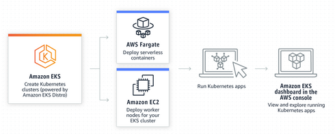
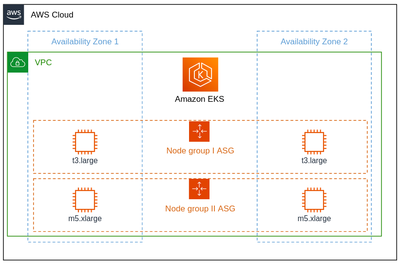

# AWS Elastic Kubernetes Service (EKS) 

Kubernetes is shipped by [many different distributions](https://nubenetes.com/matrix-table/#), each aimed for a specific purpose.
Throughout this tutorial we will be working with Elastic Kubernetes Service (EKS), which is a Kubernetes cluster managed by AWS.  

## Elastic Kubernetes Service (EKS)

> [!IMPORTANT]
> This tutorial let you feel how a production ready Kubernetes cluster can be easily provisioned using EKS, but since this resource is quite expensive, **you should delete your EKS clusters after creation**. 
> 

To provision an EKS cluster using the AWS Management Console, follow the below docs:   
https://docs.aws.amazon.com/eks/latest/userguide/create-cluster.html

Cluster provisioning takes several minutes.

Upon successful creation, configure `kubectl` to communicate with your cluster by adding a new context to the `kubeconfig` file.

```shell
aws eks --region <region> update-kubeconfig --name <cluster_name>
```

Change `<region>` and `<cluster_name>` accordingly.

## Manage Nodes

A fresh EKS cluster does have the Control Plane server, doesn't have Nodes.

EKS cluster offer different approaches to create and manage Nodes:

1. **EKS managed node groups**: EKS create and manage the cluster EC2 instances for you. Just choose an instance type, minimum and maximum number of Nodes. 
2. **Self-managed nodes**: you manually add EC2 instances to the cluster. You have to create the instances yourself, configure them and connect them to the cluster Control Plane.  
3. **AWS Fargate**: a technology that provides on-demand, right-sized compute capacity without even seeing the EC2 instances. You don't have to provision, configure, or scale groups of virtual machines on your own. Just schedule a Pod and AWS will take control on compute themselves (feels like "serverless" cluster). 

We will use the **EKS manage node groups** approach. 



### EKS managed node groups

Managed node groups are a blend of automation and customization for managing a collection of EC2 instances within an EKS cluster.
AWS takes care of tasks like patching, updating, and scaling nodes, easing operational aspects.




Amazon EKS provides specialized AMIs that are called [Amazon EKS optimized AMIs](https://docs.aws.amazon.com/eks/latest/userguide/eks-optimized-ami.html).
The AMIs are configured to work with Amazon EKS.


To create a managed node group using the AWS Management Console:

1. Wait for your cluster status to show as `ACTIVE`.
2. Open the Amazon EKS console at https://console.aws.amazon.com/eks/home#/clusters.
3. Choose the name of the cluster that you want to create a managed node group in.
4. Select the **Compute** tab.
5. Choose **Add node group**.
6. On the **Configure node group** page, fill out the parameters accordingly. 
   - **Node IAM role** – Choose the node instance role to use with your node group. [Read here how to do it](https://docs.aws.amazon.com/eks/latest/userguide/create-node-role.html#create-worker-node-role).
   - **Minimum size** - **1**.
   - **Maximum size** - **2**.
7. On the **Set compute and scaling configuration** page, fill out the parameters accordingly:
   - **Instance types** - Choose `t*.large`.
8. Watch the status of your nodes and wait for them to reach the `Ready` status:
  ```bash
  kubectl get nodes --watch
  ```

## Install EBS CSI driver

The [EBS CSI driver](https://github.com/kubernetes-sigs/aws-ebs-csi-driver) allows you to create and manage EBS volumes as storage for the Kubernetes Volumes that you create. 

The Amazon EBS CSI plugin requires IAM permissions to make calls to AWS APIs on your behalf. For more information, see [Creating the Amazon EBS CSI driver IAM role](https://docs.aws.amazon.com/eks/latest/userguide/csi-iam-role.html).

1. Open the Amazon EKS console at https://console.aws.amazon.com/eks/home#/clusters
2. In the left navigation pane, choose **Clusters**.
3. Choose the name of the cluster that you want to configure the Amazon EBS CSI add-on for.
4. Choose the **Add-ons** tab.
5. Choose **Get more add-ons**.
6. On the **Select add-ons** page, do the following:

    - In the **Amazon EKS-addons** section, select the **Amazon EBS CSI Driver** check box.
    - Choose **Next**.
7. On the **Configure selected add-ons settings** page, select the name of an **IAM role** that you attached the Amazon EBS CSI driver IAM policy.
8. On the **Review and add** page, choose **Create**. 

## Provision the Online Boutique service

Let's deploy the Online Boutique service

```bash 
kubectl apply -f k8s/online-boutique/release-0.8.0.yaml
```

## Nodes Autoscaling 

So far, we've seen Pod horizontal autoscaling (HPA). 
But Kubernetes clusters have actually two levels of scaling - Pod level scaling (done using HPA), and Node level scaling. 

Amazon EKS supports two Node level autoscaling products:

1. [Karpenter](https://karpenter.sh/): Karpenter is a flexible, high-performance Kubernetes cluster autoscaler (see exercise below).
2. [Cluster Autoscaler](https://github.com/kubernetes/autoscaler/blob/master/cluster-autoscaler/cloudprovider/aws/README.md):  automatically adjusts the number of nodes using Auto Scaling groups.

## Cleanup your experimental clusters

> [!IMPORTANT]
> When you're done with experimenting provisioning of EKS cluster, please delete your cluster and node groups. 
