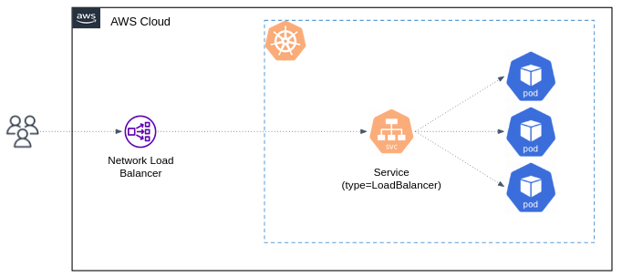

# Kubernetes networking

The Kubernetes networking model facilitates communication between pods within a cluster, and from the outside world into the cluster.

- Pods can communicate with each other using their internal IP addresses. 
  Every pod in a cluster can reach every other pod without NAT.
- **Services** provide a stable endpoint (`ClusterIP`) that abstracts the underlying pod instances. Services enable load balancing and automatic discovery of pod changes.
  Pods can use the service name as a DNS entry to connect to other services.
- The **kube-proxy** is a network proxy that runs on each node in your cluster. It allows network communication to your Pods from network sessions inside or outside your cluster.


So far, we've seen how to use Services to publish services only for consumption **inside your cluster**.

## Expose applications outside the cluster using a Service of type `LoadBalancer`

Kubernetes allows you to create a Service of `type=LoadBalancer` (no need to apply the below example):

```yaml
apiVersion: v1
kind: Service
metadata:
  name: my-service
spec:
  type: LoadBalancer
  selector:
    app.kubernetes.io/name: MyApp
  ports:
    - protocol: TCP
      port: 80
      targetPort: 9376
  clusterIP: 10.0.171.239
```

This Service takes effect only on cloud providers which support external load balancers (like AWS ELB). 
Applying this Service will **provision a load balancer for your Service**.



Traffic from the Elastic Load Balancer is directed to the backend Pods by the Service. The cloud provider decides how it is load balanced across different cluster's Nodes.

Note than the actual creation of the load balancer happens asynchronously, and information about the provisioned balancer is published in the Service's `.status.loadBalancer` field.

## Ingress and Ingress controller 

A Service of type `LoadBalancer` is the core mechanism that allows you to expose application to clients outside the cluster. 

What now? should we set up a separate Elastic Load Balancer for each Service we wish to make accessible from outside the cluster?
Doesn't this approach seem inefficient and overly complex in terms of resource utilization and cost?

It is. Let's introduce an **Ingress** and **Ingress Controller**.

Ingress Controller is an application that runs in the Kubernetes cluster that manage external access to services within the cluster. 
There are [many Ingress Controller implementations](https://kubernetes.io/docs/concepts/services-networking/ingress-controllers/) for different usages and clusters. 

[Nginx ingress controller](https://github.com/kubernetes/ingress-nginx) is one of the popular used one. 
Essentially, it's the same old good Nginx webserver app, exposed to be available outside the cluster (using Service of type `LoadBalancer`), and configured to route incoming traffic to different Services in the cluster (a.k.a. reverse proxy). 


**Ingress** is another Kubernetes object, that defines the **routing rules** for the Ingress Controller.

Let's deploy an Ingress Controller and apply an Ingress with routing rules. 

## Deploy the Nginx Ingress Controller

Ingress controllers are not started automatically with a cluster, you have to deploy it manually. 
We'll deploy the [Nginx Ingress Controller behind an AWS Network Load Balancer (NLB)](https://kubernetes.github.io/ingress-nginx/deploy/#aws).

> [!IMPORTANT]
> Applying this manifest should be done in EKS cluster, and only **once per cluster**.

```bash 
kubectl apply -f https://raw.githubusercontent.com/kubernetes/ingress-nginx/controller-v1.8.2/deploy/static/provider/aws/deploy.yaml
```  

The above manifest mainly creates:

- Deployment `ingress-nginx-controller` of the Nginx webserver.
- Srvice `ingress-nginx-controller` of type `LoadBalancer`. 
- IngressClass `IngressClass` to be used in the Ingress objects (see `ingressClassName` below).
- RBAC related resources. 

Now apply the below Ingress: 

```yaml
# k8s/ingress_demo.yaml

apiVersion: networking.k8s.io/v1
kind: Ingress
metadata:
  name: online-boutique-ing
spec:
  rules:
  - http:
      paths:
      - path: /
        pathType: Prefix
        backend:
          service:
            name: frontend
            port:
              number: 80
  ingressClassName: nginx
```

When you apply this yaml, an ingress resource will be created managed by the `ingress-nginx` instance.
Nginx is configured to automatically discover all ingress where `ingressClassName: nginx` is present.
Please note that the ingress resource should be placed inside the same namespace of the backend resource.

Visit the application using the NLB domain name. 


#### Ingress vs Ingress Controller

Please make sure you understand the relation between Ingress and Ingress Controller:

**Ingress** only defines the *routing rules*, it is not responsible for the actual routing mechanism.  
An Ingress controller is responsible for fulfilling the Ingress routing rules. 
In order for the Ingress resource to work, the cluster must have an Ingress Controller running.
