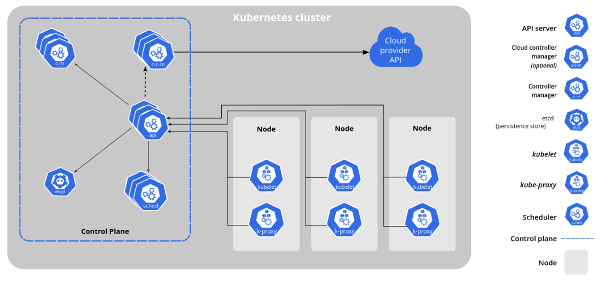
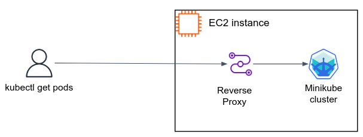

# Kubernetes setup and introduction

Like the Linux OS, Kubernetes (or shortly, k8s) is shipped by [many different distributions](https://nubenetes.com/matrix-table/#), each aimed for a specific purpose.
Throughout this course we will be working with [Minikube](https://minikube.sigs.k8s.io/docs/), and later, with [Elastic Kubernetes Service (EKS)](https://docs.aws.amazon.com/eks/), which is a Kubernetes cluster managed by AWS.  

## Installing Minikube 

Minikube is a lightweight and single-node Kubernetes distribution that is primarily used for local development and learning.

Minikube is one of the preferred [learning tools](https://kubernetes.io/docs/tasks/tools/) in Kubernetes official documentation.  

Follow the [Get Started!](https://minikube.sigs.k8s.io/docs/start/) page in minikube docs to install it on your local machine. 
Your minikube cluster relies upon some virtualization platform, we will be using Docker as the minikube driver (install Docker if needed). 

> Note:    
> If your machine isn't strong enough to run minikube, you can run it on an `medium` Ubuntu EC2 instance with 30GB disk.   

You can start the cluster by:

```bash
minikube start --driver docker
```

## Controlling the cluster

### Installing `kubectl`

`kubectl` is a command-line tool used to interact with Kubernetes clusters.

Download and install the `kubectl` binary from [Kubernetes](https://kubernetes.io/docs/tasks/tools/#kubectl) official site.


Make sure `kubectl` successfully communicates with your cluster:

```console
$ kubectl get nodes
NAME       STATUS   ROLES           AGE   VERSION
minikube   Ready    control-plane   10h   v1.27.4
```

The tutorial was written for Kubernetes version >= v1.27.

### Enable k8s dashboard 

The k8s dashboard is a web-based user interface.
You can use the dashboard to troubleshoot your application, and manage the cluster resources.

To enable the k8s dashboard in minikube, perform:

```bash
minikube dashboard --port 30001
```

This command occupies the terminal, allowing you to access the dashboard from your local machine. The dashboard url will be printed to stdout. 

> Note:   
> If you run minikube on a remote machine, in order to access the dashboard, make sure to forward port 30001 when connecting over ssh:
> 
> ```bash
> ssh -i <pem-file> -L 30001:localhost:30001 ubuntu@<ip>
> ```

## Kubernetes main components

When you deploy Kubernetes (using minikube, or any other distro), you get a **cluster**.

A Kubernetes cluster consists of a set of worker machines, called **nodes**, that run containerized applications (known as **Pods**).
Every cluster has at least one worker node.

The **control plane** manages the worker nodes and the Pods in the cluster.
In production environments, the control plane usually runs across multiple computers and a cluster usually runs multiple nodes, providing fault-tolerance and high availability.



#### Control Plane main components

The control plane's components make global decisions about the cluster (for example, scheduling), as well as detecting and responding to cluster events (for example, starting up a new pod when a deployment's replicas field is unsatisfied).

- **kube-apiserver**: The API server is the front end for the Kubernetes control plane.
- **etcd**: Consistent and highly-available key value store used as Kubernetes' backing store for all cluster data.
- **kube-scheduler**: Watches for newly created Pods with no assigned node, and selects a node for them to run on.
- **kube-controller-manager**: Runs [controllers](https://kubernetes.io/docs/concepts/overview/components/#kube-controller-manager). There are many different types of controllers. Some examples of them are:
  - Responsible for noticing and responding when nodes go down.
  - Responsible for noticing and responding when a Deployment is not in its desired state.

#### Node components

Node components run on every node, maintaining running pods and providing the Kubernetes runtime environment.

- **kubelet**: An agent that runs on each node in the cluster. It makes sure that containers are running in a Pod.
- **kube-proxy**: kube-proxy is a network proxy that runs on each node in your cluster. It allows network communication to your Pods from network sessions inside or outside your cluster.
- **Container runtime**: It is responsible for managing the execution and lifecycle of containers ([containerd](https://containerd.io/) or [CRI-O](https://cri-o.io/)).


### Kubernetes API server and the `kubectl` cli

The core of Kubernetes' control plane is the **API server**. The API server exposes an HTTP API that lets you communicate with the cluster, and let k8s components communicate with one another.

Usually you don't communicate with the API server directly, but using `kubectl`, which internally communicates with the API server on your behalf.

For example, to list your Pods:

```console
$ kubectl get pods
NAME                               READY   STATUS    RESTARTS   AGE
flask-deployment-7f6549f7b6-6lm9k  1/1     Running   0          2m
```

The above output shows only the running Pods in the `default` namespace. 
In Kubernetes, **namespaces** provides a mechanism for isolating groups of resources within a single cluster.

To list Pods from all namespaces:


```console
$ kubectl get pods --all-namespaces
NAMESPACE              NAME                                         READY   STATUS    RESTARTS      AGE
kube-system            coredns-5d78c9869d-rdzzt                     1/1     Running   2 (9h ago)    10h
kube-system            etcd-minikube                                1/1     Running   2 (9h ago)    10h
kube-system            kube-apiserver-minikube                      1/1     Running   2 (9h ago)    10h
kube-system            kube-controller-manager-minikube             1/1     Running   2 (9h ago)    10h
kube-system            kube-proxy-cs4mq                             1/1     Running   2 (9h ago)    10h
kube-system            kube-scheduler-minikube                      1/1     Running   2 (9h ago)    10h
kube-system            storage-provisioner                          1/1     Running   5 (26m ago)   10h
kubernetes-dashboard   dashboard-metrics-scraper-5dd9cbfd69-64kvk   1/1     Running   2 (9h ago)    10h
kubernetes-dashboard   kubernetes-dashboard-5c5cfc8747-9wsj6        1/1     Running   3 (9h ago)    10h
```

`kubectl` can communicate with multiple existed k8s clusters. To change the cluster with which `kubectl` is communicating:

```console 
$ kubectl config use-context my-production-cluster
Switched to context "my-production-cluster".

$ kubectl config use-context my-dev-cluster
Switched to context "my-dev-cluster".
```

### Organizing cluster access using kubeconfig files

How `kubectl` "knows" our minikube cluster? 

`kubectl` uses **kubeconfig file** to find the information it needs to choose a cluster and communicate with the API server of a cluster.

By default, `kubectl` looks for a file named `config` in the `$HOME/.kube` directory. 
Let's take a look on your `~/.kube/config`. The three main entries are `users`, `clusters` and `contexts`. 

- `users` are identities, defined by certificate and key. 
- `clusters` defines certain cluster information that you may want to interact with. Each entry under clusters typically includes the cluster name, the cluster's API server URL, and the CA certificate used to verify the authenticity of the cluster's API server certificate.
- A `context` is used to group access information under a convenient name. Each context has three parameters: `cluster`, `namespace`, and `user`, which basically says: "Use the credentials of the user X to access the Y namespace of the Z cluster".


## Deploy applications in the cluster

Let's see Kubernetes cluster in all his glory! 

**Online Boutique** is a microservices demo application, consists of an 11-tier microservices.
The application is a web-based e-commerce app where users can browse items, add them to the cart, and purchase them.

Here is the app architecture and description of each microservice:


| Service                                              | Language      | Description                                                                                                                       |
| ---------------------------------------------------- | ------------- | --------------------------------------------------------------------------------------------------------------------------------- |
| frontend                           | Go            | Exposes an HTTP server to serve the website. Does not require signup/login and generates session IDs for all users automatically. |
| cartservice                     | C#            | Stores the items in the user's shopping cart in Redis and retrieves it.                                                           |
| productcatalogservice | Go            | Provides the list of products from a JSON file and ability to search products and get individual products.                        |
| currencyservice             | Node.js       | Converts one money amount to another currency. Uses real values fetched from European Central Bank. It's the highest QPS service. |
| paymentservice               | Node.js       | Charges the given credit card info (mock) with the given amount and returns a transaction ID.                                     |
| shippingservice             | Go            | Gives shipping cost estimates based on the shopping cart. Ships items to the given address (mock)                                 |
| emailservice                   | Python        | Sends users an order confirmation email (mock).                                                                                   |
| checkoutservice             | Go            | Retrieves user cart, prepares order and orchestrates the payment, shipping and the email notification.                            |
| recommendationservice | Python        | Recommends other products based on what's given in the cart.                                                                      |
| adservice                         | Java          | Provides text ads based on given context words.                                                                                   |
| loadgenerator                 | Python/Locust | Continuously sends requests imitating realistic user shopping flows to the frontend.                                              |


To deploy the app in you cluster, perform the below command from the root directory of your shared repo (make sure the YAML file exists): 

```bash 
kubectl apply -f k8s/online-boutique/release-0.8.0.yaml
```

By default, applications running within the cluster are not accessible from outside the cluster.
There are various techniques available to enable external access, we will cover some of them later on.

Using port forwarding allows developers to establish a temporary tunnel for debugging purposes and access applications running inside the cluster from their local machines.

```bash
# Change nginx-75f59d57f4-4nd6q to the name of the Pod
kubectl port-forward svc/frontend 8080:80
```

> Note:   
> If you run minikube on a remote machine, and want to access the application using the EC2 public ip address, perform:
> 
> ```bash
> kubectl port-forward svc/frontend 8080:80 --address 0.0.0.0
> ```

# Self-check questions

[Enter the interactive self-check page](https://alonitac.github.io/UPES-CSDV-3004/multichoice-questions/k8s_setup_and_intro.html)

# Exercises 

### :pencil2: Connect to minikube node using ssh 

This short exercise demonstrates and stresses the fact that k8s is just **containers orchestrator**,
and under the hood, there are nothing but running docker containers in each cluster's node. 

In real k8s cluster, nodes are usually virtual machines, like EC2 instances.
But in Minikube node are virtualized within the machine minikube is running on. 
Nevertheless, minikube nodes have an IP address, and you can connect them via ssh as if you are connecting to a real server. 

Connect to one of your cluster's nodes using the `ssh` command (don't use the `minikube ssh` utility):

- The cluster name (profile name) and node IP can be found in `minikube profile list`.
- The username is `docker`.
- The private key identity file can be found in `~/.minikube/machines/<CLUSTER_NAME>/id_rsa`.

Inside the node, use `docker` command to list the running containers on that node. 
Can you recognize the containers running the Online Boutique app?

### :pencil2: Provision multi-node cluster with Minikube 

Start a new minikube cluster named `multinode-demo` with 2 **worker** nodes. 

- Make sure there are two worker nodes and one control plane node in the cluster. 
- Observing the kubeconfig file, what is the API's server IP of the cluster?
- Delete the cluster at the end. How does the kubeconfig look like after the deletion? 

These commands might help:

```bash 
minikube stop
kubectl get nodes
minikube status -p multinode-demo
minikube profile list
```

### :pencil2: Minikube addons 

Minikube includes a set of built-in addons that can be enabled, disabled and opened in the local Kubernetes environment.

List the currently supported addons:

```bash
minikube addons list
```

Enable an addon, the `metrics-server` addon:

```bash
minikube addons enable metrics-server
```

[Metrics Server](https://github.com/kubernetes-sigs/metrics-server) is an application (running in a container within your cluster) that collects metrics (e.g. Pod CPU and Memory utilization) from the cluster node and exposes them in Kubernetes apiserver.

To be able to pull images from an ECR repository, [configure credentials for ECR using `registry-creds` addon](https://minikube.sigs.k8s.io/docs/tutorials/configuring_creds_for_aws_ecr/).

### :pencil2: Working with `kubectl` against multiple clusters

Utilize [kubectl Cheat Sheet](https://kubernetes.io/docs/reference/kubectl/cheatsheet/) throughout this exercise. 

1. Start a new Minikube cluster name `minikube-dev` with Kubernetes version `v1.22.0`.
1. Start a new Minikube cluster name `minikube-prod` with Kubernetes version `v1.27.0`.
1. Set up the autocomplete functionality for `kubectl`. 
1. Take a look on the kubeconfig file by `kubectl config view`. Make sure you have at least 2 available clusters.
1. List your kubeconfig contexts
1. Switch to work with `minikube-dev` cluster, `describe` your cluster nodes. 
1. Switch to work with `minikube-prod` cluster, `describe` your cluster nodes. 


### :pencil2: The `kubectl proxy` command and k8s dashboard

The **Kubernetes Dashboard** we've seen during the tutorial is itself an web application running on your cluster.
You can see the dashboard's Pods in the `kubernetes-dashboard` namespace:

```bash
kubectl get pods -n kubernetes-dashboard
```

Follow the [tutorial](https://kubernetes.io/docs/tasks/extend-kubernetes/http-proxy-access-api/) from k8s docs.
Then try to visit the k8s dashboard using `kubectl proxy` command. Make sure the `minikube dashboard` is not running.

### :pencil2: Working with kubeconfig files

Follow:    
https://kubernetes.io/docs/tasks/access-application-cluster/configure-access-multiple-clusters/


### :pencil2: Access minikube cluster from remote machine using Nginx reverse proxy

To be done in Minikube running on an EC2 instance. 

By design, minikube create k8s cluster with which you can communicate only from within the machine the cluster is running on. 
If you want to communicate with your cluster (i.e. running `kubectl` commands) from a remote machine, you should use expose the cluster's API server using method like reverse proxy. 

In this exercise we will expose your cluster using an Nginx reverse proxy.



Start a minikube cluster by `minikube start -p test-cluster`.

Get the kubeconfig content:

```bash 
kubectl config view
```

Under `users` entry, indicate the user used to connect to `test-cluster` and copy its `client-certificate` and `client-key` files to some directory on the minikube host machine.

Create a directory in which the Nginx server configuration file would be located:

```bash 
sudo mkdir -p /etc/nginx/conf.d/
```

Inside the directory, create the following `minikube.conf` file:

```text
server {
    listen       80;
    listen  [::]:80;
    server_name  localhost;  
    
    location / {   
        proxy_pass https://MINIKUBE_IP:8443;
        proxy_ssl_certificate /etc/nginx/certs/minikube-client.crt;
        proxy_ssl_certificate_key /etc/nginx/certs/minikube-client.key;
    }
}
```

From the minikube host machine, launch a (containerized) Nginx server:

```bash

docker run -d --name nginx -p 8080:80 -v MINIKUBE_CLIENT_KEY_PATH:/etc/nginx/certs/minikube-client.key -v MINIKUBE_CLIENT_CERT_PATH:/nginx/certs/minikube-client.crt -v /etc/nginx/conf.d/:/etc/nginx/conf.d nginx
```

Use again the `kubectl config view` command to create a `custom-kubeconfig.yaml` file **in your local machine**. 
Change the `server:` entry to the `http://<INSTANCE_IP>:80`, as well as other entries related to authentication. 

At the end, communicate with the minikube cluster form your local machine:

```bash
kubectl get pods --kubeconfig custom-kubeconfig.yaml
```
